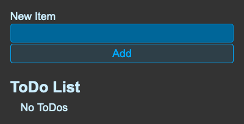
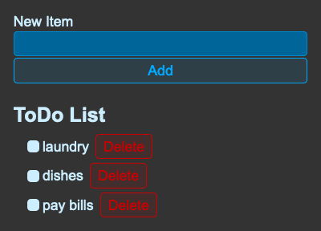

# react-to-do-list
A to-do list built with React. Based on [Web Dev Simplified's tutorial "Learn React With This One Project"](https://youtu.be/Rh3tobg7hEo)

## Contents 

- [Overview](#overview)
  - [Built with](#built-with)
- [Screenshots](#screenshots)
- [Status](#status)
- [Connect](#connect)

## Overivew
This app offers the ability to add items to a ToDo list with features like checking items 'completed' and the option to delete items. The list is stored in `localStorage` so the data persists even when the page is refreshed.

### Built with

- HTML
- CSS
- JavaScript
- React

## Screenshots

## Status

A live version can be viewed at: https://react-todo-966cb7.netlify.app/. 

## Connect

Thank you for reading about this project. If you'd like to connect with me for mentoring, collaboration, or employment opportunities, you can do so via the following links:

- [Email](https://anthonynanfito.com/contact/)
- [LinkedIn](https://linkedin.com/in/anthonynanfito)
- [Portfolio](https://ananfito.github.io)
- [Blog](https://ananfito.hashnode.dev)
